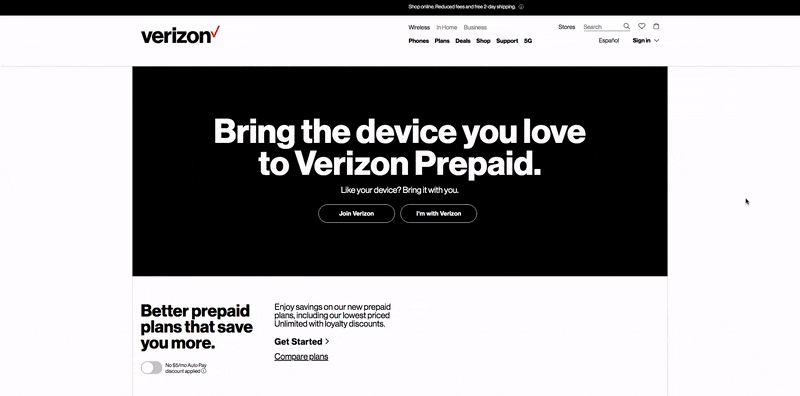

# Range Slider

This range slider features a unique visual aesthetic that is updated based on slider progress. The range slider is tied to pricing details that are discounted based on range slider progress and toggle button state.

I initially built out this UI along with the rest of the page for a rebranding of the VZ prepaid product. This slider and pricing section was also rolled out to related pages after the initial launch.

## Features

- Range Slider bar changes color based on progress
- Specific progress markers are indicated based on slider progress
- Data set (ideally pricing info) can easily be paired to range slider
- Price change animates in an odometer style fashion. Odometer was leveraged for this effect. [Odometer](https://github.com/HubSpot/odometer)

### Concept demo

Simplified demo illustrating core concept

[Range Slider concept](https://uiblox.github.io/vz-rangeslider/)

Built with vanilla javascript, SCSS, using ES6 modules, and using laravel mix for the project build.
